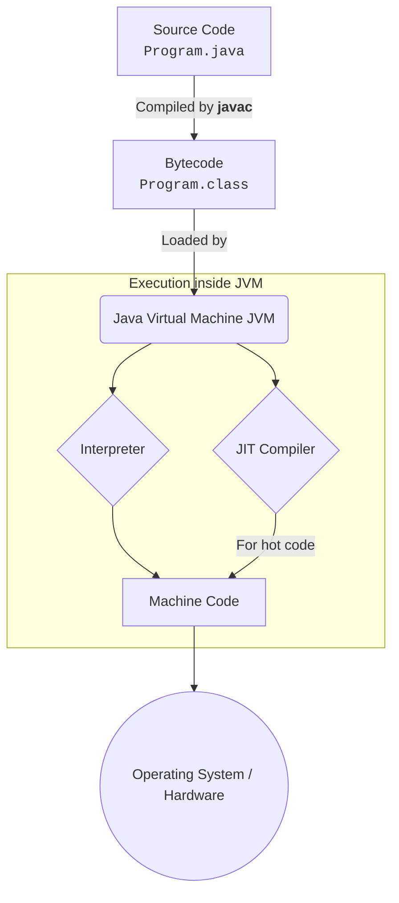
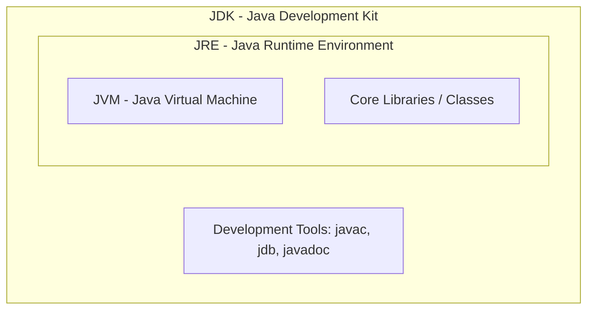

# Java: The Complete Theoretical Foundation

Java is a high-level, class-based, object-oriented programming language designed to have as few implementation dependencies as possible. Its philosophy is **WORA (Write Once, Run Anywhere)**.

## 1. The Java Execution Pipeline

Unlike C or C++ which are compiled directly to machine code, Java uses a unique two-step process: **Compilation** and **Interpretation (via the JVM)**.

### Step 1: Compilation (`javac`)
When you write Java code, it is saved in a `.java` file. You pass this file to the Java Compiler (`javac`). 
Instead of producing machine code (which only one specific operating system can understand), `javac` produces **Bytecode** (`.class` files). Bytecode is highly optimized intermediate code that is completely independent of your operating system.

### Step 2: Execution (`java` / JVM)
To run the `.class` file, you use the `java` command, which starts the **Java Virtual Machine (JVM)**. The JVM reads the Bytecode and translates it on-the-fly into native machine code that your specific computer hardware can execute.

---

## 2. Platform Independence vs. Platform Dependence

This two-step process is the secret behind Java's portability.

> [!TIP]
> **Java is Platform Independent, but the JVM is Platform Dependent.**

- **The Language (Platform Independent):** The Bytecode (`.class` file) you generated on a Windows machine can be copied to a Mac or Linux machine, and it will run perfectly without needing to be recompiled.
- **The JVM (Platform Dependent):** Because native machine code is different for Windows, Mac, and Linux, the JVM itself must be custom-built for each Operating System. You download a Windows JVM for Windows, a Mac JVM for Mac, etc. The JVM acts as a universal translator between the universal Bytecode and the local hardware.

---

## 3. The Java Ecosystem: JDK, JRE, and JVM

Java's ecosystem is divided into three nested layers depending on what you need to do.

1. **JVM (Java Virtual Machine):** The engine that actually executes the bytecode.
2. **JRE (Java Runtime Environment):** Contains the JVM + standard Java libraries (like `java.util`, `java.io`). If you only want to *play* a Java game or *run* a Java app, you only need to install the JRE.
3. **JDK (Java Development Kit):** Contains the JRE + development tools like the compiler (`javac`) and debugger. If you want to *write* and *build* Java apps, you need the JDK.

---

## 4. The JIT (Just-In-Time) Compiler

Because the JVM historically interpreted Bytecode line-by-line, Java was slower than purely compiled languages like C++. 

To fix this, modern JVMs include the **JIT (Just-In-Time) Compiler**. 
- As the JVM interprets your code, the JIT compiler secretly watches the execution. 
- When it notices a "hot spot" (a block of code or loop that is executed over and over again), it compiles that Bytecode directly into native machine code and caches it.
- The next time that code runs, it runs at the speed of native C++ code!
